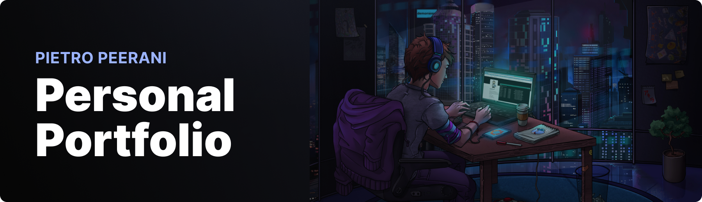

<div align="center">
  <br />
    
  <br />

  <div>
    
    
  </div>

  <h3 align="center">💻 Simplefolio 💻</h3>

</div>


## 📋 <a name="table">Table of Contents</a>
1. ⚙️ [Tech Stack](#tech-stack)
2. 🔋 [Features](#features)
3. 🤸 [Quick Start](#quick-start)
4. ✏️ [Personalization](#personalization)
5. 🚀 [Deploy](#deploy)
6. 📄 [License](#license)


## <a name="tech-stack">⚙️ Tech Stack</a>
- Next JS
- Tailwind CSS


## <a name="features">🔋 Features</a>
- ✅ **Responsive Design**: Ensures optimal display and functionality across all devices.
- ✅ **Blog**


## <a name="quick-start">🤸 Quick Start</a>

Follow these steps to set up the project locally on your machine.

**Prerequisites**

Make sure you have the following installed on your machine:

- [Git](https://git-scm.com/)
- [Node.js](https://nodejs.org/)
- [npm](https://www.npmjs.com/) (Node Package Manager)

**Cloning the Repository**

```bash
git clone https://github.com/pietropeerani/simplefolio.git simplefolio
cd simplefolio
```

**Installation**

Install the project dependencies using npm:

```bash
npm i
```

**Running the Project**

```bash
npm run dev

npm run dev -- -H 0.0.0.0 -p 3000 # host development server on local network
```

Open [http://localhost:3000](http://localhost:3000) in your browser to view the project.


## <a name="personalization">✏️ Personalization</a>
**Set Up Enviroment Variables**

Go to `@/next.config.mjs` to modify the general info:
```JSON
"env": {
  "name": "John",
  "lastName": "Brown"
}
```

**Add Works**

1. Go to `@/src/app/(pages)/work/articles/` folder.
2. Create a new file with the url name of the page (so without spaces) and a folder in the `@/public/work` directory with the same name.
3. Add metadata:
```md
---

title: Title
subtitle: Subtitle
image: image.jpg         # cover image
imagePosition: "cover"   # you can also define the contain position 
date: 01-01-2024
textColor: "#fff"
bgColor: "#ff00000d"
render: true

---
```


## <a name="deploy">🚀 Deploy</a>
[](https://vercel.com/new/clone?repository-url=https%3A%2F%2Fgithub.com%2pietropeerani%2Fsimplefolio)


<div align="center">
  <br />
    
  <br />

</div>


## <a name="license">📄 License</a>
This project is licensed under the MIT License - see the [LICENSE](LICENSE) file for details.
